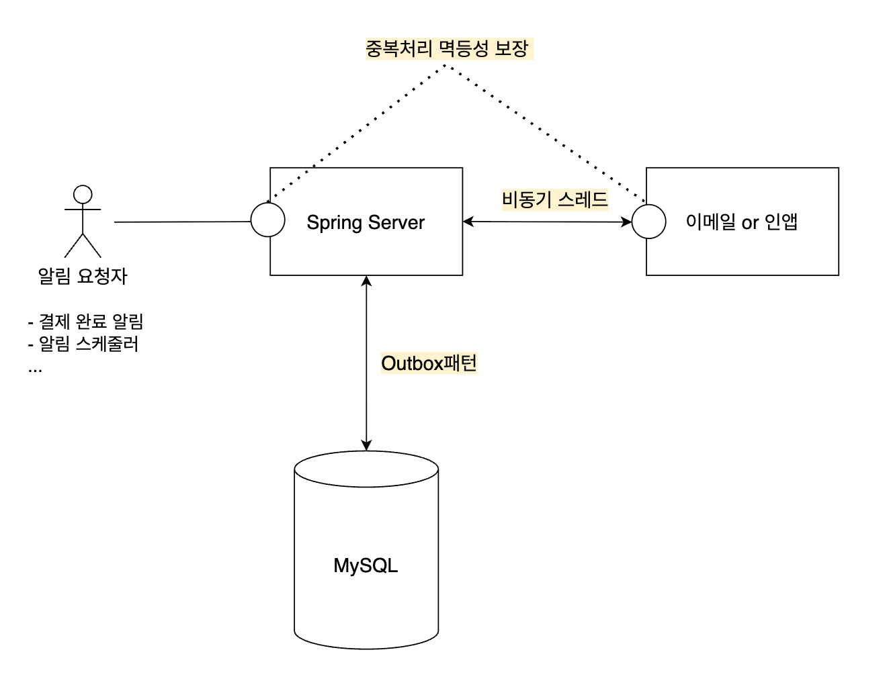
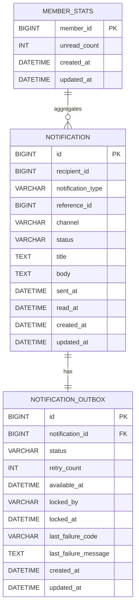

## 프로젝트 개요
다양한 이벤트 알림 발송 시의 상황을 가정하고 백엔드단 시스템 설계 및 구현을 하였습니다.  
멱등성, 예외처리에 대한 재시도, 그리고 최대한 기존 기술 스택을 활용한 아키텍처 설계 고민을 하였습니다.(추가적인 인프라 발생 비용을 줄이기 위해)

전체 아키텍처는 위와 같습니다.
크게 3가지 기능을 구현하였습니다.
- 중복처리에 대한 **멱등성 처리**
- 알림 이벤트에 대한 영속성을 관리하기 위한 **트랜잭션 아웃박스 패턴**
- 처리량을 향상시키기 위한 **비동기 스레드 도입**

## 기술 스택
- Java 21+
- JPA
- Spring Boot 3+
- MySQL 8+

## 실행 방법
### 사전 준비
- Java 21+
- 애플리케이션 실행 시: MySQL 8+
- 테스트 실행 시: Docker Desktop 또는 Docker Engine

### 애플리케이션 실행
1. MySQL 8+를 실행합니다.
2. 애플리케이션 전용 계정과 데이터베이스를 생성합니다.
```sql
CREATE DATABASE IF NOT EXISTS notification_system;
CREATE USER IF NOT EXISTS 'notification'@'localhost' IDENTIFIED BY 'notification';
CREATE USER IF NOT EXISTS 'notification'@'127.0.0.1' IDENTIFIED BY 'notification';
GRANT ALL PRIVILEGES ON notification_system.* TO 'notification'@'localhost';
GRANT ALL PRIVILEGES ON notification_system.* TO 'notification'@'127.0.0.1';
FLUSH PRIVILEGES;
```
3. 로컬 환경에 맞게 DB 접속 정보를 환경변수로 지정합니다.
```bash
export DB_URL="jdbc:mysql://localhost:3306/notification_system?createDatabaseIfNotExist=true&serverTimezone=Asia/Seoul&characterEncoding=UTF-8"
export DB_USERNAME="notification"
export DB_PASSWORD="notification"
```
4. 기본 프로필은 `application.yml`에서 `local`로 지정되어 있습니다.
필요하면 `spring.profiles.default` 값을 바꿔 다른 기본 프로필로 실행할 수 있습니다.
5. 애플리케이션을 실행합니다.
```bash
./gradlew bootRun
```

### Swagger
- Swagger UI: `http://localhost:8080/swagger-ui.html`
- OpenAPI JSON: `http://localhost:8080/api-docs`
- `X-USER-ID` 헤더가 필요한 API는 Swagger UI에서 직접 헤더 값을 넣어 테스트할 수 있습니다.

### 테스트 실행
- 테스트는 `Testcontainers MySQL`을 사용하므로, **Docker가 실행 중이면 로컬 MySQL 없이도** 동작합니다.
- 현재 통합 테스트는 MySQL 컨테이너를 직접 기동하므로 Docker가 필요합니다.

```bash
./gradlew test
```
## API 목록 및 예시
#### 알림 발송 요청
`POST /api/notifications`
```json
Request
{
  "recipientId": 1001,
  "notificationType": "PAYMENT_CONFIRMED",
  "channel": "EMAIL",
  "referenceId": 5001
}

Response
{
  "notificationId": 1,
  "status": "PENDING",
  "accepted": true,
  "message": "알림 요청이 접수되었습니다."
}

```
#### 특정 알림 조회
`GET /api/notifications/{notificationId}`
헤더: `X-USER-ID: 1001`
```json
Response
{
  "notificationId": 1,
  "recipientId": 1001,
  "notificationType": "PAYMENT_CONFIRMED",
  "channel": "EMAIL",
  "referenceId": 5001,
  "status": "SENT",
  "isRead": false,
  "readAt": null,
  "sentAt": "2026-04-08T15:20:31",
  "lastFailureCode": null,
  "lastFailureMessage": null,
  "createdAt": "2026-04-08T15:20:00"
}
```
#### 사용자 알림 목록 조회
`GET /api/notifications?read=UNREAD&page=0&size=20`
헤더: `X-USER-ID: 1001`
```json
Response
{
  "unreadCount": 1,
  "content": [
    {
      "notificationId": 3,
      "notificationType": "COURSE_START_D_MINUS_1",
      "channel": "IN_APP",
      "status": "SENT",
      "isRead": false,
      "readAt": null,
      "sentAt": "2026-04-08T09:00:00",
      "createdAt": "2026-04-08T08:59:50"
    },
    {
      "notificationId": 1,
      "notificationType": "PAYMENT_CONFIRMED",
      "channel": "EMAIL",
      "status": "SENT",
      "isRead": false,
      "sentAt": "2026-04-08T15:20:31",
      "createdAt": "2026-04-08T15:20:00"
    }
  ],
  "page": 0,
  "size": 20,
  "hasNext": false
}
```

## 데이터 모델 설명
알림 테이블과 알림 이벤트에 대한 영속성 보장을 위해 알림 아웃박스 테이블을 설계하였습니다. 
#### 알림 테이블
- `notification_type`: 알림 유형
- `reference_id`: 동일 이벤트 식별값(참조 데이터)
- `channel`: 이메일 or 인앱 구분
- `status`: 사용자 관점의 발송 상태(`PENDING`, `SENDING`, `SENT`, `FAILED`)
#### 회원 통계 테이블
- `member_id`: 알림 수신 사용자 식별값
- `unread_count`: 읽지 않은 알림 개수의 역정규화 값
#### 알림 아웃박스 테이블
- `status`: 워커 처리 상태 (`PENDING`, `PROCESSING`, `COMPLETED`, `DEAD`)
- `retry_count`: 현재까지 재시도한 횟수
- `available_at`: 아웃박스 레코드를 다시 처리할 수 있는 시각
- `locked_by`: 다중 인스턴스 환경에서 어떤 인스턴스가 선점했는지 식별하기 위한 값
- `last_failure_code`, `last_failure_message`: 마지막 실패 원인 기록



## 요구사항 해석 및 가정
```plain
배경 시나리오 1)
- 알림 처리 실패가 비즈니스 트랜잭션에 영향을 주어서는 안 됩니다. 단, 예외를 단순히 무시하는 방식으로 이를 달성해서는 안 됩니다.
- 네트워크 장애, 외부 이메일 서버 오류 등 일시적 장애에 대비해 재시도가 가능해야 합니다. 
```
#### 설명:  
트랜잭션 분리로 알림 처리를 독립적으로 가능하도록 해야 되겠다고 생각이 들었습니다.  
예외를 무시하지 않는 것과 일시적 장애 케이스들은 알림 이벤트 영속성을 보장하며 재시도 전략을 통해 완료되도록 설계를 생각하였습니다.

```plain
배경 시나리오 2)
- 동일한 이벤트에 대해 알림이 중복 발송되면 안 됩니다.
```
#### 설명:  
**멱등 키**를 설계하여 중복 요청을 방지하도록 해야되겠다고 생각이 들었습니다.  
**가정**: 참조 데이터(referenceId)는 유일한 식별키라고 가정하였습니다. 
- 예외케이스: lectureId가 referenceKey로 온다면 제대로된 멱등 키 역할을 하지 못할 수 있기 때문입니다.
  - 예: 동일한 강의에 대한 결제 과정(완료 -> 취소)가 2번 이상 반복되면 알림이 와야됨에도 중복 처리 될 수 있음.


```plain
배경 시나리오 3)
- 이벤트 발생 시 사용자에게 이메일 또는 인앱 알림을 발송해야 합니다.
```
#### 설명:
이 부분은 이메일 또는 인앱 등 추후에 확장 가능성을 고려한 **전략 패턴**이 적합하겠다고 판단이 들었습니다.  

```plain
필수 구현 1. 알림 발송 요청 API
- 사용자 알림 목록 조회: 수신자 기준 알림 목록(읽음/안읽음 필터 포함)
```
#### 설명:
읽음/안읽음 부분은 **복합 인덱스**를 통해 조회 성능 향상을 생각하였습니다.

```plain
필수 구현 2. 알림 처리 상태 관리
- 알림 상태를 적절히 정의하고, 각 상태의 전이 조건을 설계하세요.
- 발송 실패 시 재시도 정책과 최종 실패 처리 방식을 설계하세요.
- 실패 사유는 기록되어야 합니다.
```
#### 설명:
알림 발송 상태는 PENDING, SENDING, SENT, FAILED로 구상하였습니다.  
각 상태 전이 과정이 언제 발생하는지와 예외 케이스일 경우 어떻게 대처할 건지 고민이 필요했습니다. 

```plain
필수 구현 5. 운영 시나리오 대응
- 처리 중 상태가 일정 시간 이상 지속되는 경우 복구 방법을 설계하세요.
- 서버 재시작 후에도 미처리 알림이 유실 없이 재처리되어야 합니다.
- 다중 인스턴스 환경에서도 동일 알림이 중복 처리되어서는 안 됩니다.
```
#### 설명:
- 처리 중 상태일 때 어느 부분에서 문제가 발생했는 지 파악하는 것이 필요할 것이라고 생각이 들었습니다.
- 서버 재시작 후에도 미처리 알림이 없기 위해 알림 이벤트를 Outbox 패턴을 활용한 테이블에 기록하는 것이 필요하다고 판단하였습니다.
- 다중 인스턴스 환경에서 동일 알림 중복 처리를 막기 위해 **멱등성 개념**과 더불어 **Outbox 테이블에 동시에 접근하는 것을 막는 기법**이 필요함을 생각하였습니다.

```plain
선택 구현
- 발송 스케줄링: 특정 시각에 발송 예약 기능
- 알림 템플릿 관리 (타입별 메시지 템플릿)
- 읽음 처리: 여러 기기에서 동시에 읽음 처리 요청이 오면 어떻게 처리할 것인가?
- 최종 실패 알림 보관 및 수동 재시도: 재시도 시 재시도 횟수 초기화 여부를 어떻게 정책화할 것인가?
```
#### 설명:
- 발송 스케줄링은 스케줄러를 이용하여 손쉽게 구현 할 수 있지만 싱글 스레드로 동작한다는 점과 멀티 인스턴스에서 중복되는 경우 고려하는 것이 필요하다고 생각하였습니다.
- 알림 템플릿은 다양한 이벤트 타입별 분리와 재사용성 가능한 코드를 설계를 신경써야겠다고 생각하였습니다.
- 여러 기기에서 동시에 읽음 처리 요청이 왔을 때는 읽음 처리의 카운트를 관리하는지 유무에 따라 다르게 처리가 필요할 것 같습니다.
  - **관리하지 않는 경우**: 중복 처리가 상관 없음
  - **관리하는 경우**: 중복처리하면 카운트 정합성이 깨짐
- 재시도: 고민..

## 설계 결정과 이유
### 1. 멱등성 설계
멱등성이 필요한 곳은 `클라이언트 -> 스프링 서버`, `스프링 서버 -> DB`, `스프링 서버 -> 외부 서버(알림 수신)` 이렇게 3 곳 입니다.
#### 1.1 클라이언트 -> 스프링 서버 
동일 요청이 재전송되거나 중복 호출될 수 있으므로, 요청 단위 멱등 키가 필요했습니다.
이부분은 클라이언트단에서 멱등 키를 생성할 지, 스프링 서버에서 생성할 지 고민이 필요했습니다.  
```plain
설계 결정)
- 주어진 요청 파라미터를 조합하여 고유한 멱등 키를 설계할 수 있는지 여부를 판단하였습니다.  
- 위에서 파라미터로 고유한 referenceyKey가 온다고 가정하였기에 서버단에서 멱등키를 설계해도 괜찮다고 판단하였습니다.   
```


#### 1.2 스프링 서버 -> DB
DB 반영 후 응답을 받지 못한 경우 동일 요청이 들어올 수 있습니다.  
이부분은 (1) 과 동일한 멱등 키 전략을 이용하면 되었고 유니크 제약을 통해 DB단 정합성을 보장하였습니다.
```plain
설계 결정)
1. 멱등 키
- recipientId + notificationType + referenceKey + channel로 멱등 키 설계
- recipientId는 수신자 구분, notificationType은 알림의 비즈니스 의미 구분, referenceKey는 동일 이벤트 식별, channel은 채널별 발송 구분 용도입니다.
2. 유니크 제약
- 멱등 키가 DB에 실제로 중복 저장되지 않도록 유니크 제약을 설정 하였습니다.
```

#### 1.3 스프링 서버 -> 외부 서버
read timeout 처럼 발송 성공 여부가 불확실한 경우를 대비하여, 외부 발송에도 멱등 키 전략이 필요하다고 판단하였습니다.
이부분은 외부 서버에서도 멱등성 개념을 적용한다고 가정하였습니다.  
```plain
설계 결정)
멱등키: 알림 테이블의 notificationId, 즉 PK로 설정하였습니다.
```

### 2. 트랜잭션 아웃박스 패턴 구현
`스프링 서버 -> 외부 서버` 에서 알림 발송 시 네트워크 장애(Connection/Read Timeout)나 외부 서버 일시 장애와 같은 다양한 예외 상황이 존재합니다. 
이러한 상황에서 알림 이벤트의 **영속성을 보장**하여 재시도 전략을 수립하고자 트랜잭션 아웃박스 패턴을 구현하였습니다.
```plain
설계 결정) 
재시도 관련 필드 구현:  
- 현재 재시도 중인지 파악하는 것과 다음 재시도 가능 시간을 설정하는 부분이 필요했습니다.
- 특히, 다음 재시도 시간동안 스레드가 블로킹되면 안되었기에 미리 다음 재시도 가능 시간을 계산하여 필드에 기록하는 방향으로 하였습니다. 
- retry_count, available_at 필드    

예외 상황 기록 필드 구현: 
- 예외 상황이 발생하였을 때 어떠한 오류 때문인지 파악하는 로그가 필요하였습니다.
- 이를 별도의 필드를 추가하여 기록하는 방식으로 하였습니다.
- last_failure_code, last_failure_message 필드

멀티 인스턴스 환경을 고려한 선점 필드 구현:
- 멀티 인스턴스 환경에서 특정 인스턴스가 작업을 처리하다가 죽는 경우가 존재하였습니다.
- 이때, 해당 작업이 얼마나 지났는지 확인하기 위한 필드가 필요하였습니다.
- locked_by, locked_at 필드
```

### 3. 비동기 스레드 도입
알림 발송은 API 요청 스레드와 분리되 처리되어야 한다는 요구사항이 있었습니다.   
이를 만족하기 위해 `@Async` 메서드를 활용하여 비동기 처리를 설계하였습니다.
#### 가상 스레드 활용
개수가 많은 I/O 작업일 경우 플랫폼 스레드만 활용하는 것보다 가상 스레드가 더 유리할 수 있다고 판단하였습니다.  
플렛폼 스레드는 스레드 개수에 상대적으로 제약이 있지만 가상 스레드는 생성 비용이 매우 가볍기 때문입니다.   
이를 쉽게 교체할 수 있도록 스프링 IoC/DI 개념을 적용하여 설계하였습니다.

### 4. 비즈니스 트랜잭션과 알림 처리 분리
비즈니스 처리와 알림 처리는 서로 영향을 주면 안된다는 요구사항이 있었습니다.  
이를 해결하고자 비즈니스 완료후 알림 처리 로직이 실행이 보장되도록 하는 `@TransactionalEventListner(AFTER_COMMIT)`을 활용하였습니다.

### 5. 복구 스케줄러 사용
비동기 스레드로만 알림 발송 로직을 담당하기에는 다양한 예외 케이스가 존재하였습니다. 
- 예시 1) 아웃박스 테이블에 이벤트를 `PROCESSING` 상태로 기록하고 비동기 스레드 오류
- 예시 2) 서버 오류로 갑자기 꺼졌을 때, DB에 미처리 Outbox가 남아있는 경우  
..

이같은 상황을 대처하기 위해 **별도 스케줄러 잡**으로 주기적으로 2차 검증을 하여 알림을 발송해주는 로직을 추가하였습니다.
```plain
설계 결정)
- PENDING 상태 + available_at <= now()일 때 
- PROCESSING 상태 + locked_at <= now() - lease_timeout  
위와 같은 경우일 때를 식별하여 스케줄러가 다시 처리하도록 설계하였습니다.
```
#### 고민점) 비동기 스레드와 스케줄러 잡이 겹칠 때 경우
Outbox테이블에서 아직 PENDING인 상태인 row가 비동기 스레드와 스케줄러 잡이 동시에 잡으려고 하는 경우가 발생할 수 있습니다.   
- Case 1: 최악의 경우 스케줄러 잡이 대규모로 UPDATE를 진행한다면 그동안 해당 비동기 스레드는 블로킹 됩니다.  
- Case 2: 반대로 비동기 스레드가 UPDATE로 락을 잡았을 때 스케줄러 잡도 진행중이었다면 블로킹에 빠집니다.
```plain
설계 결정)
- Case1을 해결하기 위해 스케줄러 잡의 배치 단위를 적절히 조절하는 식으로 블로킹 시간을 최대한 줄이고자 하였습니다.
- Case2를 MySQL의 SKIP LOCKED 옵션을 이용하여 락이 잡힌 row들은 스킵하여 경합 상태를 없애도록 하였습니다. 
```
### 6. 알림 상태 전이 및 재시도 정책
알림 상태 전이는 일정 시간 지속되는 경우도 고려해야했기에 `PROCESSING` 상태를 추가하였고 
지속적으로 실패할 경우 `DEAD`도 추가하였습니다.  
1. `PENDING` -> `PROCESSING`
   - AFTER_COMMIT 이후 비동기 스레드가 실행할 때
   - 스케줄러 잡이 복구 작업 진행할 때
2. `PROCESSING` -> `COMPLETED`
   - 외부 서버에 전송하고 응답까지 받았을 때
3. `PROCESSING` -> `PENDING`
   - 다양한 예외 케이스 상황에서 스케줄러 잡이 상태 이전으로 복구할 때
4. `PROCESSING` -> `DEAD`
   - 최대 재시도 횟수를 넘었을 때 관리자가 수동 확인이 필요한 경우

재시도는 아래와 같은 경우에 시도하도록 설계하였습니다.
```plain
예외 케이스) 
- 네트워크 타임아웃, 429, 500번대 에러 발생 시
- lease_timeout 지난 PROCESSING 상태인 데이터
```
2번 트랜잭션 아웃박스 패턴을 활용하여 관련 필드들을 기록하였고 에러 로그를 확인할 수 있는 필드도 추가하도록 하였습니다.
### 7. 선택 구현
#### 7.1 발송 스케줄링
다중 인스턴스 환경에서 별도의 조치를 하지 않으면 동일한 작업이 동시에 발생하는 경우가 발생할 수 있습니다.
이를 해결하기 위해 총 3가지로 케이스를 나눌 수 있었습니다.
```plain
Case 1. 애초에 특정 인스턴스에서만 해당 작업을 담당하도록 수동 코드 설계
Case 2. 스케줄링 작업을 외부 프로세스 또는 별도 워커 시스템으로 분리
Case 3. 분산락을 활용하여 특정 인스턴스만 작업할 수 있도록 설계
```
저는 과제 상황을 고려해 Case3으로 구현하기로 결정하였습니다.    
Case1은 동시 발생에 대한 근본적인 해결책이 아니었고, Case2는 별도의 인프라 구축이 필요했기 때문입니다.  
구현 방식은 @ShedLock을 통한 DB 분산락을 활용하였습니다.

#### 7.2 알림 템플릿 관리
알림 메시지는 알림 타입에 따라 반복적으로 재사용되므로, 별도의 템플릿으로 분리하는 것이 적절하다고 판단하였습니다.
`notification_type`에 따라 템플릿을 선택하고, 참조 데이터를 치환하여 최종 메시지를 생성할 수 있도록 하였습니다. 

#### 7.3 여러 기기에서 동시에 읽음 처리
여러 기기에서 동시에 읽는 것 자체는 멱등하기에 여러번 읽음 처리해도 상관없습니다. 
다만 만약 읽지않은 개수를 관리하는 경우는 고려점이 달랐습니다.
- 매번 `COUNT()`로 읽지 않은 개수를 집계하는 방식
  - 장점: 별도 카운트 칼럼 정합성을 신경 쓰지 않아도 됨
  - 단점: 목록 조회가 잦은 경우 매번 집계 쿼리가 발생하여 O(N) 비용 커짐
- 읽지 않은 개수를 별도 필드로 역정규화하는 방식
  - 장점: 조회 성능 O(1)로 최적화
  - 단점: 여러 기기에서 동시에 읽음 처리 요청이 들어올 때 중복 차감 방지를 위한 데이터 정합성 고려
```plain
설계 방식)
1. notification.read_at is null 이라면 기록 
2. member.stats에서 읽지않은 개수 차감
3. 만약 1번이 not null이면 2번 실행하지 않음
4. 위 과정을 하나의 Transaction으로 묶음
```

## 테스트 실행 방법
## 미구현 / 제약사항
## AI 활용 범위
- 멱등 키 생성을 클라이언트쪽에서 할 지, 스프링 서버에서 할 지 고민 
- Read Timeout 시 중복 처리 고민해야 될 부분
- Outbox패턴에서 재시도 전략 논블로킹으로 어떻게 풀어야 될 지
- Outbox 테이블 필드 설계시 고려해야 될 부분들 
- 별도 복구 스케줄러 작업 시 
- 개선한다면: 대규모 상황 케이스 ~~
- 선택 구현의 재시도 초기화 정책 어떻게 설정할 지
- 필드 설계시 null로 조건 검색할 지 or 따로 필드를 추가할 지
